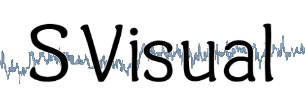
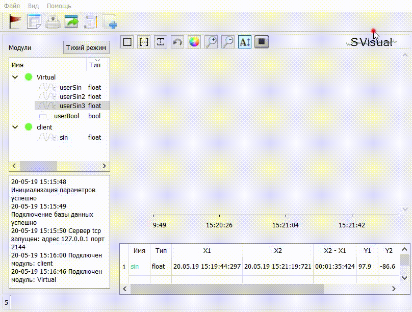
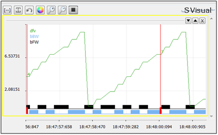

<div align="left">
  <a></a><br>
</div>

| **`Docker`** | **`License`** |
|------------------|------------------|
|[](https://travis-ci.com/Tyill/SVisual)|[](https://opensource.org/licenses/MIT)|

The SVisual software is designed to monitor the operation of the MK devices, debug the program, alert the user to the events that have occurred.

<p float="left">

 &emsp;

</p>

## Features

* connection to the MK via COM port (usb for arduino), over Ethernet or Wi-Fi protocol TCP;

* Interrogation of values of signals in real time with frequency before 1 MHz (default 10 Hz), the number of devices and signals is selected by the user;

* the permissible number of signals for recording 2048;

* output of the values of the selected signals to the monitor screen in real time;

* record the archive of signals to the PC hard disk;

* viewing the archive using additional SVViewer software;

* ability to set alerts for an event (triggers) that have occurred, start a custom process when the trigger is triggered;

* adding a signal for viewing / recording only by the client, no additional movements are required

* export data to xlsx, json or csv

* client UART+DMA for stm32f1 https://github.com/burrbull/svisual-stm32f1

* docker image https://hub.docker.com/r/tyiler/svdocker

* viewing in a web browser

* Zabbix agent supported

* Save into ClickHouseDb supported

## Demo

https://www.youtube.com/watch?v=LR0Rb964DLA&feature=youtu.be

https://www.youtube.com/watch?v=wlvArf7h6lE

## Arduino example

```cpp
#include <SVClient.h>
void setup() {

  bool ok = svisual::connectOfCOM("test");

}
int cnt = 0;
void loop() {

  svisual::addIntValue("dfv", cnt);

  ++cnt;
  if (cnt > 10) cnt = 0;

  bool odd_cnt = cnt % 2;

  svisual::addBoolValue("bFW", odd_cnt);

  svisual::addBoolValue("bBW", !odd_cnt);

  delay(200);
}
```
### As a result
<div align="left">
  <a></a><br>
</div>

## Use in Linux
Should be installed:
- qt
- sqlite: `sudo apt install libsqlite3-dev`
- libuv: `sudo apt install libuv1-dev`
- [clickhouse-cpp](depends/clickhouse-cpp-2.2.1.zip)

Aux dependences [here](depends/linux_deps/): 
- lua53
- qtXlsxWriter

Build from QtCreator:
- open QtCreator
- load project: open [CMakeLists.txt](src/CMakeLists.txt)  

Build with cmake:  
```bash
cd src
rm -rf build  
mkdir build  
cmake -B build -S . -DCMAKE_BUILD_TYPE="Release" && cmake --build build --parallel  
```

## [Manual](docs) 

## License
Licensed under an [MIT-2.0]-[license](LICENSE).


