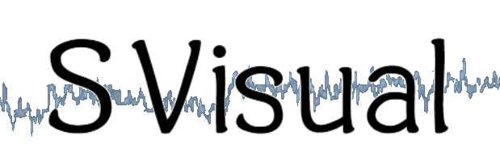
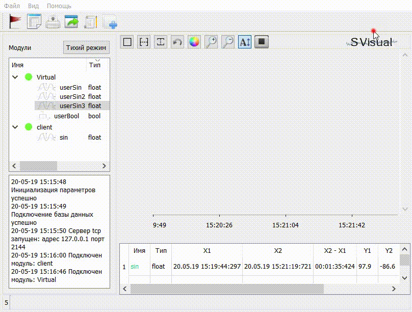
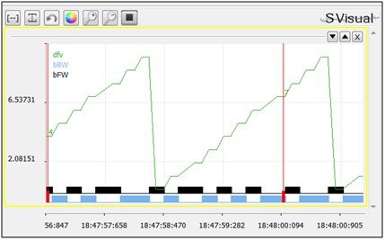

<div align="left">
  <a></a><br>
</div>

| **`Docker`** | **`License`** |
|------------------|------------------|
|[](https://travis-ci.com/Tyill/SVisual)|[](https://opensource.org/licenses/MIT)|

<p float="left">

 &emsp;

</p>

# SVisual: Real-Time Industrial Telemetry & Monitoring System

**SVisual** is a high-performance C++ application designed for real-time monitoring, data logging, and visualization of telemetry streams from industrial controllers (STM32, Arduino, and other embedded systems).

### 🛠 Why SVisual?
In critical infrastructure like **Data Centers**, monitoring power loads, temperature, and hardware status is vital. SVisual provides a lightweight and robust solution to capture these signals, visualize them in real-time, and store them for further predictive analysis.

### 🚀 Key Features
*   **Real-Time Data Streaming:** Low-latency visualization of incoming signals from hardware sensors.
*   **High-Resolution Logging:** Efficient recording of telemetry data for post-event analysis (Sequence of Events).
*   **Cross-Platform Performance:** Built with **C++ and Qt**, ensuring high throughput and stability on both Linux and Windows.
*   **Hardware Agnostic:** Easily integrates with any controller via serial or network protocols.
*   **Industrial-Grade UI:** Intuitive dashboard for monitoring multiple parameters simultaneously.

### 💻 Tech Stack
*   **Core:** C++11/17 (High-performance backend)
*   **GUI:** Qt 5.15 (QtWidgets for stable industrial HMI)
*   **Embedded Integration:** Optimized for STM32 and Arduino telemetry streams.
*   **Build System:** QMake / CMake

### 📂 Use Cases
*   **Data Center Infrastructure Monitoring (DCIM):** Tracking power usage and cooling efficiency.
*   **Industrial Automation:** Real-time feedback for electric drives and PLC-based systems.
*   **Predictive Maintenance:** Collecting signal history to identify hardware degradation before failure.

## Features

* connection to the MK via COM port (usb for arduino), over Ethernet or Wi-Fi protocol TCP;

* Interrogation of values of signals in real time with frequency before 1 MHz (default 10 Hz), the number of devices and signals is selected by the user;

* the permissible number of signals for recording 2048;

* output of the values of the selected signals to the monitor screen in real time;

* record the archive of signals to the PC hard disk;

* viewing the archive using additional SVViewer software;

* ability to set alerts for an event (triggers) that have occurred, start a custom process when the trigger is triggered;

* adding a signal for viewing / recording only by the client, no additional movements are required

* export data to xlsx, json or csv

* client UART+DMA for stm32f1 https://github.com/burrbull/svisual-stm32f1

* docker image https://hub.docker.com/r/tyiler/svdocker

* viewing in a web browser

* Zabbix agent supported

* Save into ClickHouseDb supported

## Demo

https://www.youtube.com/watch?v=LR0Rb964DLA&feature=youtu.be

https://www.youtube.com/watch?v=wlvArf7h6lE

## Arduino example

```cpp
#include <SVClient.h>
void setup() {

  bool ok = svisual::connectOfCOM("test");

}
int cnt = 0;
void loop() {

  svisual::addIntValue("dfv", cnt);

  ++cnt;
  if (cnt > 10) cnt = 0;

  bool odd_cnt = cnt % 2;

  svisual::addBoolValue("bFW", odd_cnt);

  svisual::addBoolValue("bBW", !odd_cnt);

  delay(200);
}
```
### As a result
<div align="left">
  <a></a><br>
</div>

## Use in Linux
Should be installed:
- qt
- sqlite: `sudo apt install libsqlite3-dev`
- libuv: `sudo apt install libuv1-dev`
- [clickhouse-cpp](depends/clickhouse-cpp-2.2.1.zip)

Aux dependences [here](depends/linux_deps/): 
- lua53
- qtXlsxWriter

Build from QtCreator:
- open QtCreator
- load project: open [CMakeLists.txt](src/CMakeLists.txt)  

Build with cmake:  
```bash
cd src
rm -rf build  
mkdir build  
cmake -B build -S . -DCMAKE_BUILD_TYPE="Release" && cmake --build build --parallel  
```

## [Manual](docs) 

## License
Licensed under an [MIT-2.0]-[license](LICENSE).


