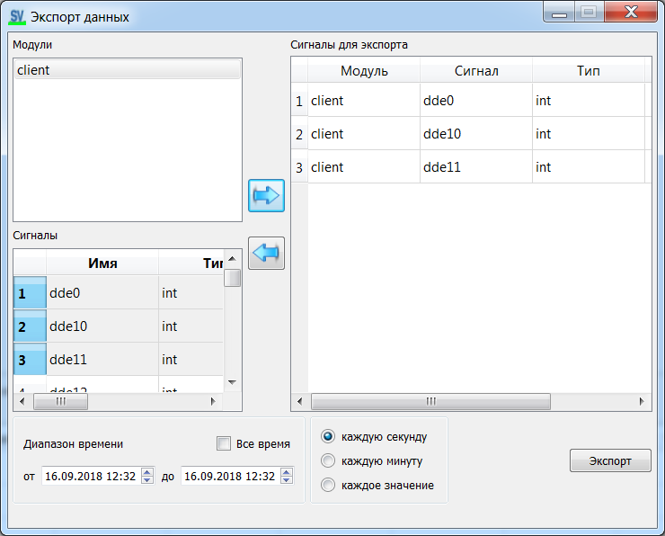

[English](export.md) | [Русский](../ru/export.md) | [Contents](../en/README.md)

# Export

From the export dialog (Monitor or Viewer):

Formats (`export_dialog_impl.cpp`):

| Format | Notes |
| --- | --- |
| **json** | Always available |
| **csv** | Always available |
| **xlsx** | If built with `USE_QtXlsxWriter` |

Pick signals, time range, then save.
