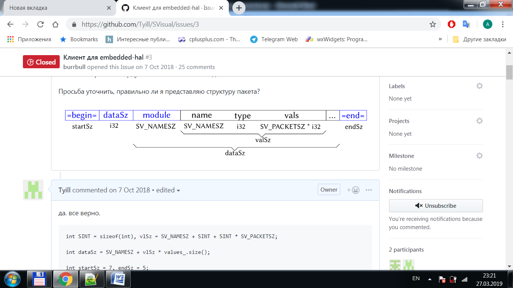

[English](protocol.md) | [Русский](../ru/protocol.md) | [Contents](../en/README.md)

# Wire protocol

Framing used by `SVClient`, Arduino, and `SVServer` (`=begin=` / size / `=end=`):

Layout:

1. Marker `=begin=` (7 bytes)
2. `int32` payload size (little-endian)
3. Module name, `SV_NAMESZ` = **24** bytes, zero-padded
4. For each signal:
   - name, 24 bytes
   - `int32` type: `0` bool, `1` int, `2` float
   - `packetSz` values (`int32` payload each; bool/int use the int field, float uses the float bits)
5. Marker `=end=` (5 bytes)

Payload size is `24 + N × (24 + 4 + 4×packetSz)` with default `packetSz = 10`.

There is **no** C# / Python package in this repository. The Word appendices are examples of this binary framing, not supported SDKs.

Names must not contain the ASCII strings `=begin=` or `=end=`.
