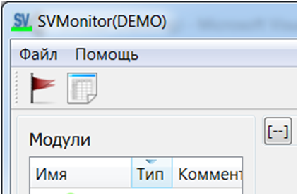
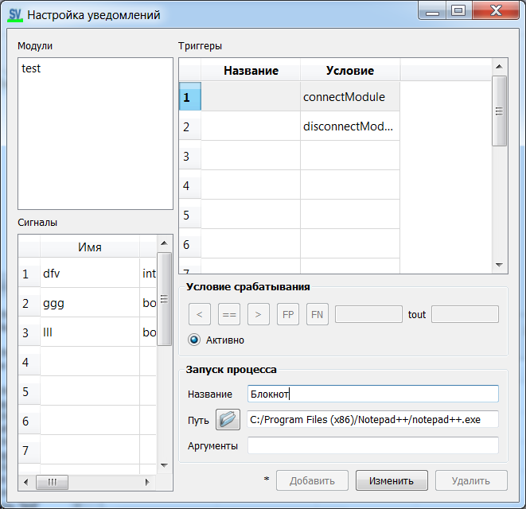

[English](triggers.md) | [Русский](../ru/triggers.md) | [Contents](../en/README.md)

# Triggers (user notifications)

A **trigger** is a condition. On fire, SVMonitor can start an external process (`userProcPath` + `userProcArgs`).

Open the dialog from the toolbar (flag icon):

## Event types (`EventType` in `trigger_dialog.h`)

| Type | Typical use |
| --- | --- |
| `CONNECT_MODULE` | Module appeared |
| `DISCONNECT_MODULE` | Module gone |
| `LESS` / `EQUALS` / `MORE` | Numeric compare to `condValue` |
| `POS_FRONT` / `NEG_FRONT` | Boolean edges |

Timeout `condTOut` is in **seconds**.

## Module triggers

Select a module (no signal). Conditions are connect / disconnect. Optionally set the process to launch.

## Signal triggers

Select a signal. For **bool**: fronts. For **int/float**: `<` `==` `>`. Enable **Active**, then **Add** / **Change**.
