[English](user-interface.md) | [Русский](../ru/user-interface.md) | [Contents](../en/README.md)

# User interface

Main window of **SVMonitor**:

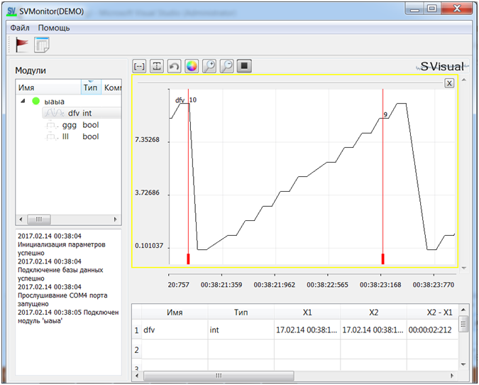

| Area | Role |
| --- | --- |
| **Signal list** (left) | Modules and signals that have connected. Double-click or drag a signal onto the plot. |
| **Status panel** | Connect/disconnect, new signals, trigger hits. |
| **Work area** | Live plots. |
| **Value table** | Values at plot markers. |
| **Toolbar** | Zoom, colors, live/follow mode, extra plot windows. |

## Signal list

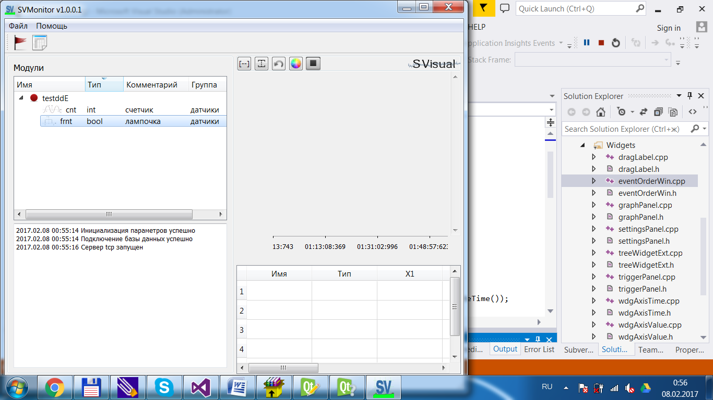

LED next to a module shows whether data is arriving.

Unused signals/modules: right-click **Delete**. An **active** module must be disconnected first.

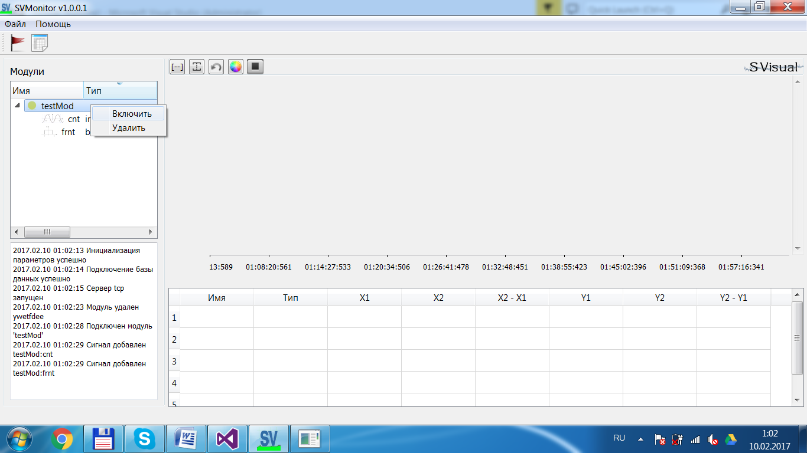

**Comment** and **Group** are stored for archive browsing in SVViewer.

## Status panel

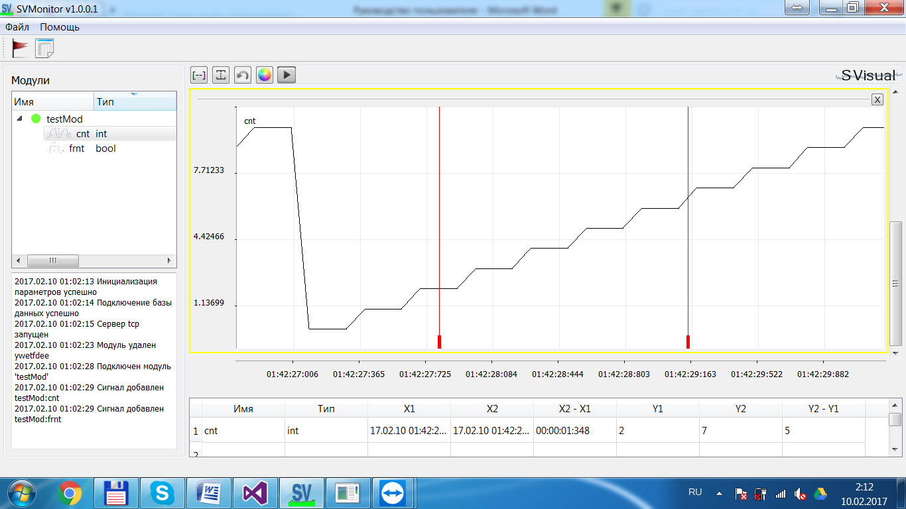

Typical messages: module list changes, trigger fires, physical connect/disconnect.

## Work area

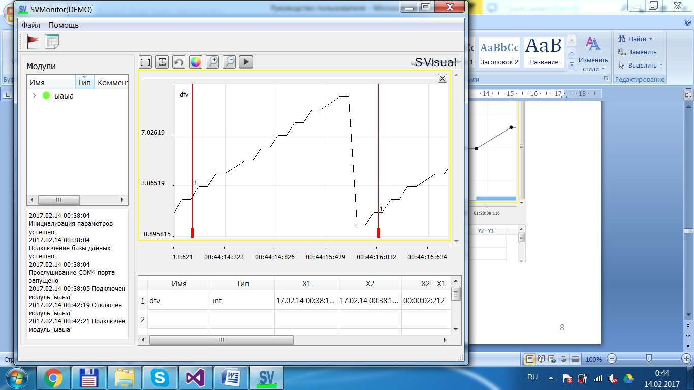

- Pan with the right mouse button
- Select a region of interest

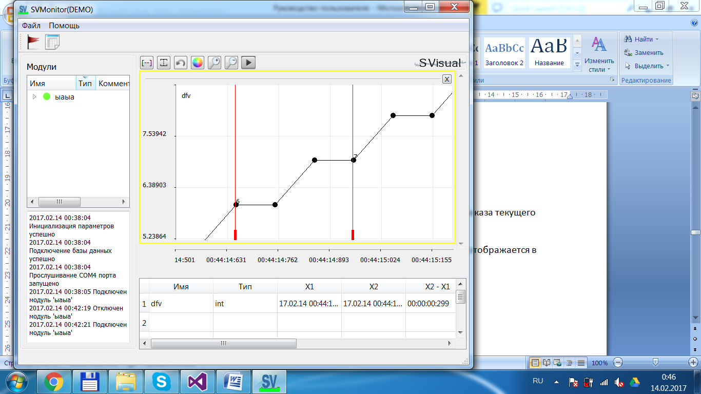

Markers:

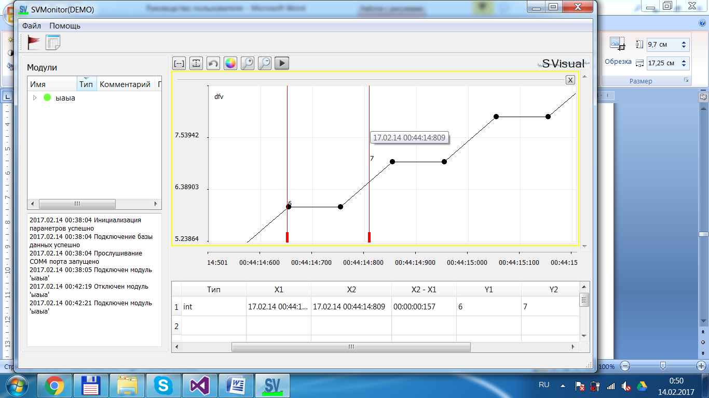

Several signals in one plot:

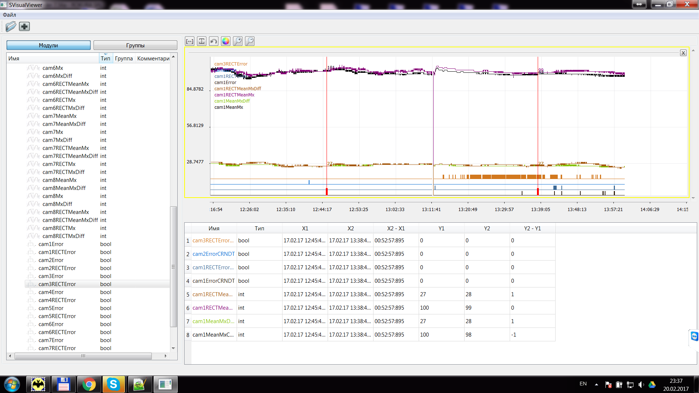

Extra plot windows and an alternate axis:

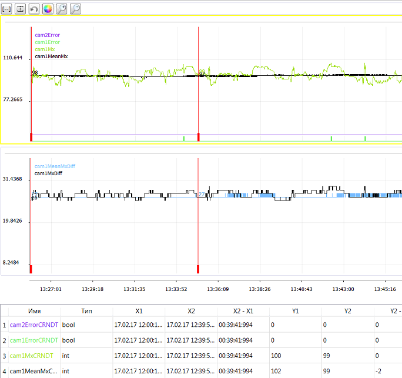

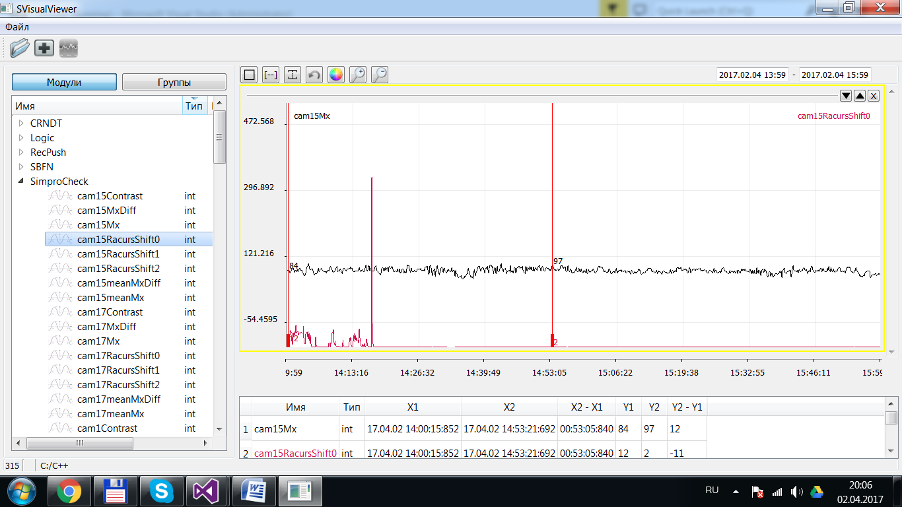

## Value table

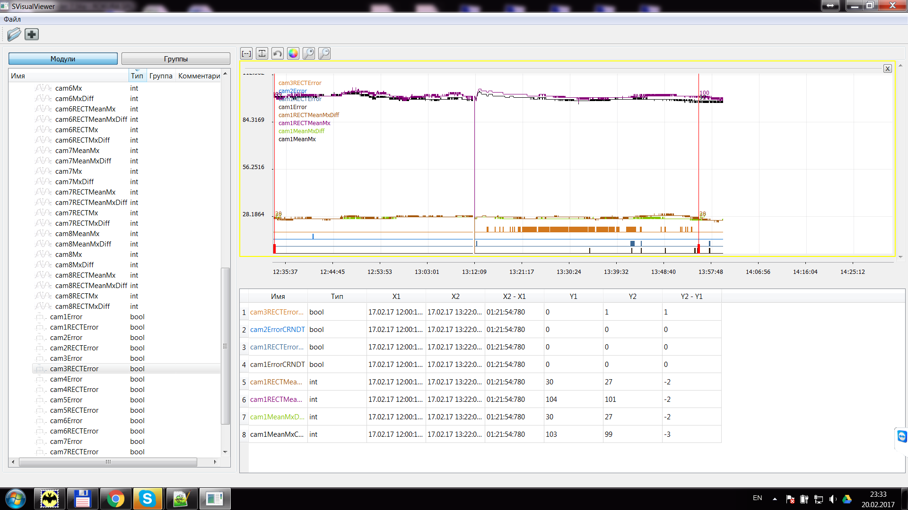

Shows marker times and `X2 − X1` for the selected interval.
