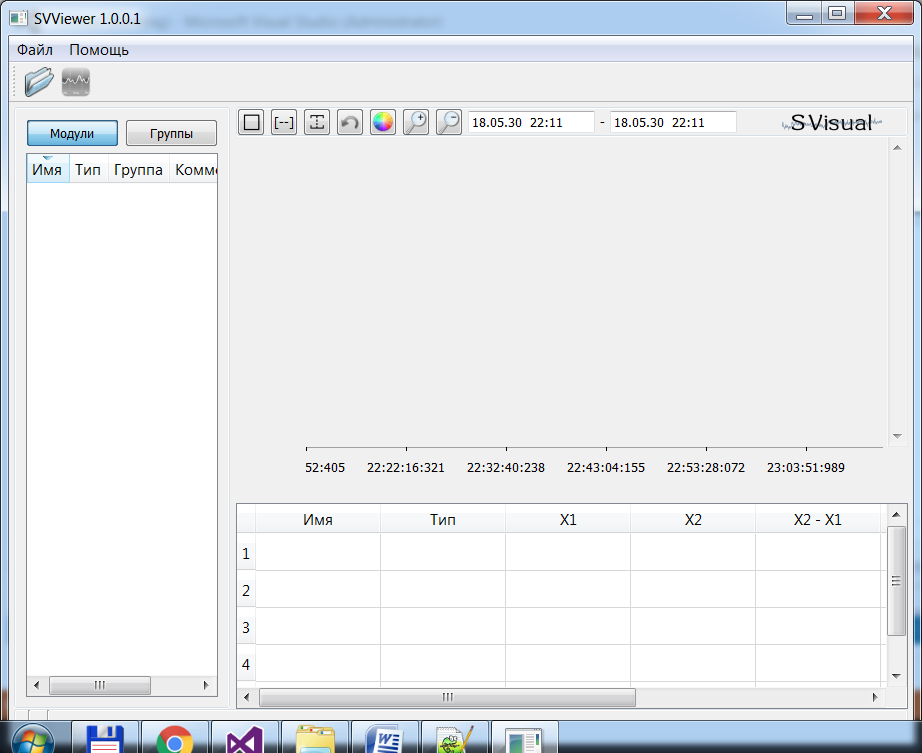
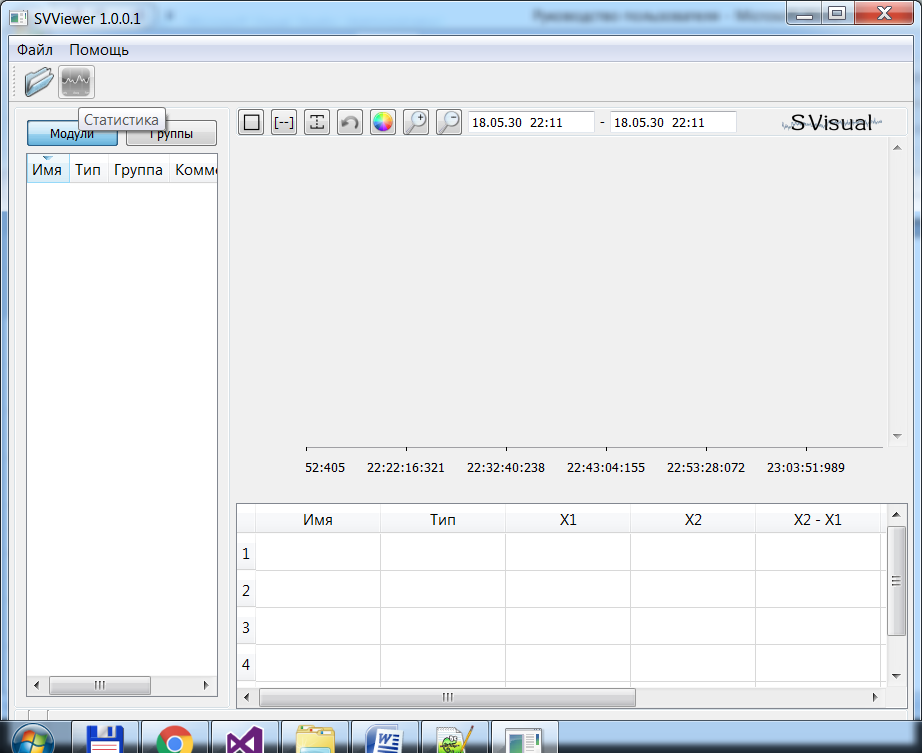
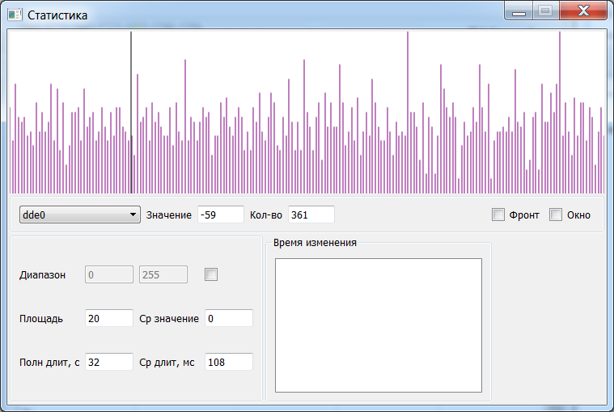

[English](../en/archives.md) | [Русский](archives.md) | [Содержание](../ru/README.md)

# Архивы

Если включено **сохранение в файл**, SVMonitor пишет архивы сигналов в каталог из настроек. Длина одного файла — `outArchiveHourCnt` часов (по умолчанию **2**, диапазон 1–12). На диск сбрасывается буфер порядка 10 минут (`src/SVServer/src/archive.cpp`).

Второй приёмник — **ClickHouse** (см. [Web, Zabbix, ClickHouse](web-zabbix.md)).

## SVViewer

Архивы открываются в **SVViewer**.

Статистика и гистограмма:

Перетащите сигнал в окно статистики. Комментарии и группы из Monitor доступны при просмотре.
