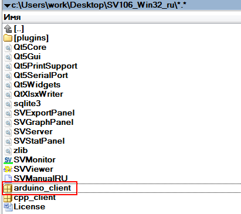
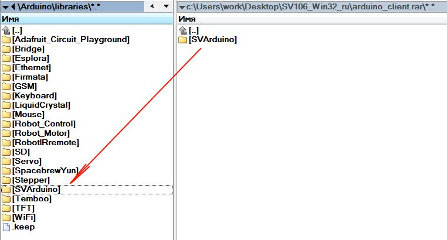
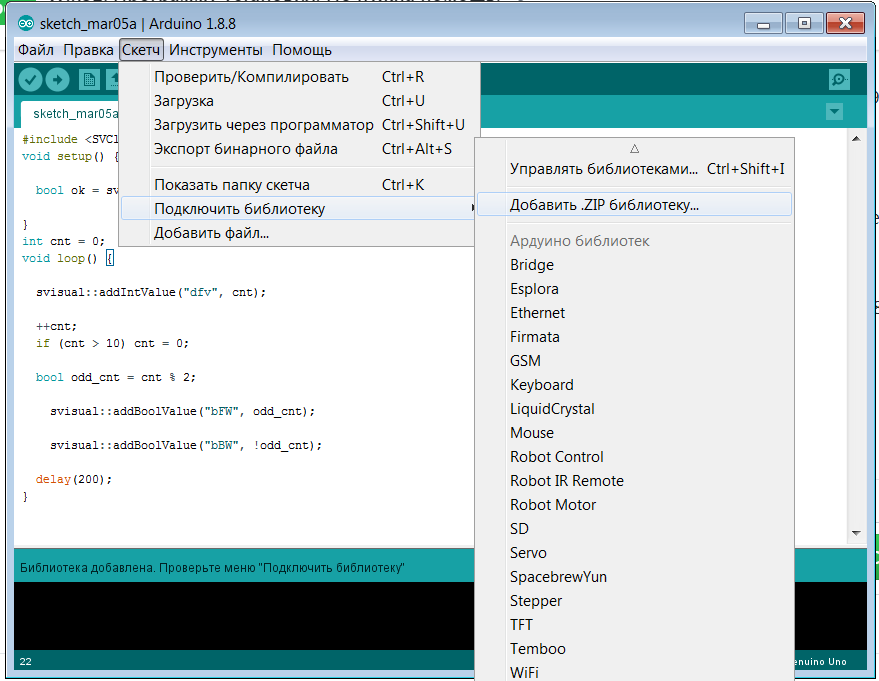

[English](../en/client-arduino.md) | [Русский](client-arduino.md) | [Содержание](../ru/README.md)

# Клиент Arduino

Заголовок: [`src/SVArduino/SVClient.h`](../../src/SVArduino/SVClient.h). Скопируйте библиотеку в каталог библиотек Arduino и подключите в скетче.







```cpp
namespace svisual {
  bool connectOfEthernet(const char* module, const char* macAddrModule,
                         const char* ipAddrModule, const char* ipAddrServ, int portServ);
  bool connectOfWiFi(const char* module, const char* ssid, const char* pass,
                     const char* ipAddrServ, int portServ);
  bool connectOfCOM(const char* module, int speed = 9600);
  bool addBoolValue(const char* name, bool value, bool onlyPosFront = false);
  bool addIntValue(const char* name, int value);
  bool addFloatValue(const char* name, float value);
}
```

| Константа | Значение |
| --- | --- |
| `SV_CYCLEREC_MS` | 100 |
| `SV_PACKETSZ` | 10 |
| `SV_VALS_MAX_CNT` | 128 |
| Длина имени | 24 |

Пакеты уходят по таймеру; из `loop()` достаточно вызывать `add*Value`.

```cpp
#include <SVClient.h>

void setup() {
  svisual::connectOfCOM("test");
}

int cnt = 0;
void loop() {
  svisual::addIntValue("dfv", cnt);
  ++cnt;
  if (cnt > 10) cnt = 0;
  bool odd = cnt % 2;
  svisual::addBoolValue("bFW", odd);
  svisual::addBoolValue("bBW", !odd);
  delay(200);
}
```

STM32 (UART+DMA): https://github.com/burrbull/svisual-stm32f1
