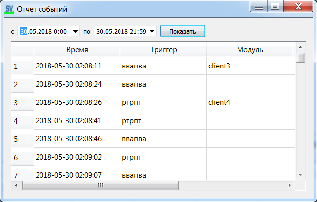

[English](../en/event-report.md) | [Русский](event-report.md) | [Содержание](../ru/README.md)

# Отчёт событий

В SVMonitor: **Отчет событий**.

В таблице — срабатывания триггеров и связанные события (время, модуль, условие). Это журнал, не замена живым графикам.
