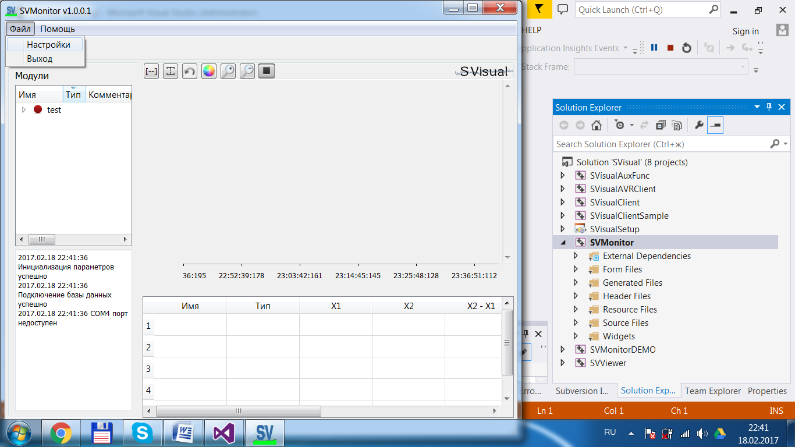
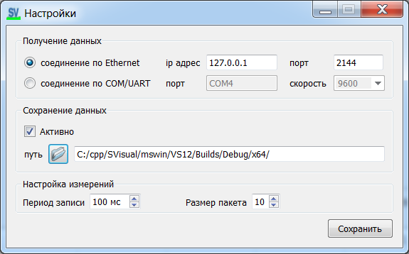

[English](../en/monitor-settings.md) | [Русский](monitor-settings.md) | [Содержание](../ru/README.md)

# Настройки SVMonitor

Меню **Файл → Настройки**.

В текущих сборках блоков больше, чем на старом скриншоте (web, Zabbix, ClickHouse, сдвиг времени). Поля — как в `settings_dialog.ui` и значения по умолчанию в `main_win.cpp`.

## Получение данных

| Режим | Что задать |
| --- | --- |
| **Ethernet** | **IP и TCP-порт этого ПК**, на котором слушает Monitor. По умолчанию `127.0.0.1:2144`. Клиенты подключаются **к** Monitor. |
| **COM/UART** | Имя порта и скорость. Порты добавляются/удаляются кнопками. Скорости 1200 … 115200. По умолчанию **9600**. |

Параметры кадра COM в ПО фиксированы (8 бит, без чётности — как в буклете).

Изменения блока **измерений** (период / пакет / сдвиг) требуют перезапуска программы.

## Web / Zabbix

| | По умолчанию |
| --- | --- |
| Адрес / порт web | `127.0.0.1` / **2145** |
| Адрес / порт агента Zabbix (пассивный) | `127.0.0.1` / **2146** |

Включается флажком **Активно**.

## Сохранение данных

| | Смысл |
| --- | --- |
| Сохранение в файл | Каталог архива, флажок **Активно** |
| Длина файла | `outArchiveHourCnt`, **1–12 часов**, по умолчанию **2** (не мегабайты) |
| ClickHouse | Имя БД (по умолчанию `svdb`) и адрес (`localhost:9000`) |

## Измерения

| Параметр | По умолчанию | Роль |
| --- | --- | --- |
| Период записи `cycleRecMs` | **100 мс** (10 Гц) | Как часто берётся отсчёт |
| Размер пакета `packetSz` | **10** | Отсчётов в одном TCP/COM пакете |
| Смещение по времени | 0 с | Сдвиг меток вперёд; нужно при частоте **> 1 кГц** |

Интервал отправки пакета: `cycleRecMs × packetSz` (при значениях по умолчанию — 1 с).
