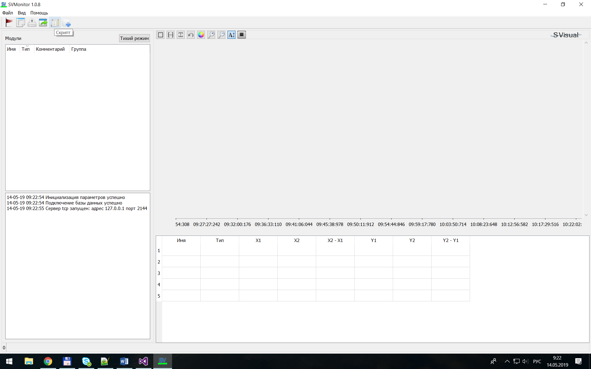

[English](../en/scripts.md) | [Русский](scripts.md) | [Содержание](../ru/README.md)

# Скрипты (виртуальные сигналы)

В SVMonitor можно считать пользовательские скрипты (Lua) и получать **виртуальные сигналы** из существующих.

В буклете есть примеры: масштаб, отсечение, комбинация сигналов. В Monitor диалог открывается в режиме плеера на живом потоке (`SV_Script::ModeGr::Player`).

Полный Lua API здесь не расписан — смотрите примеры в самом окне.
