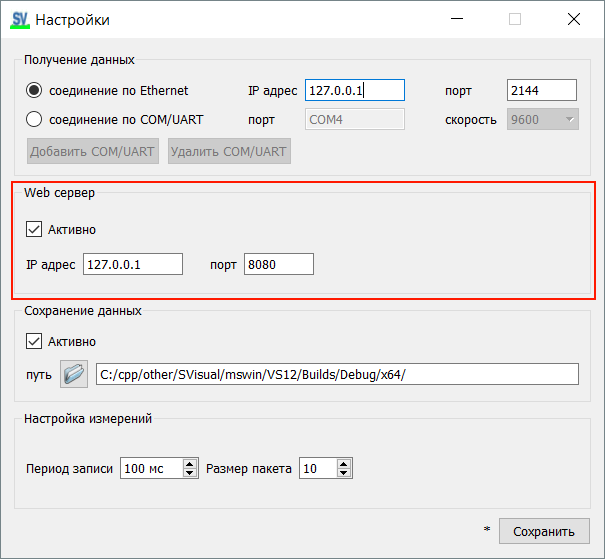
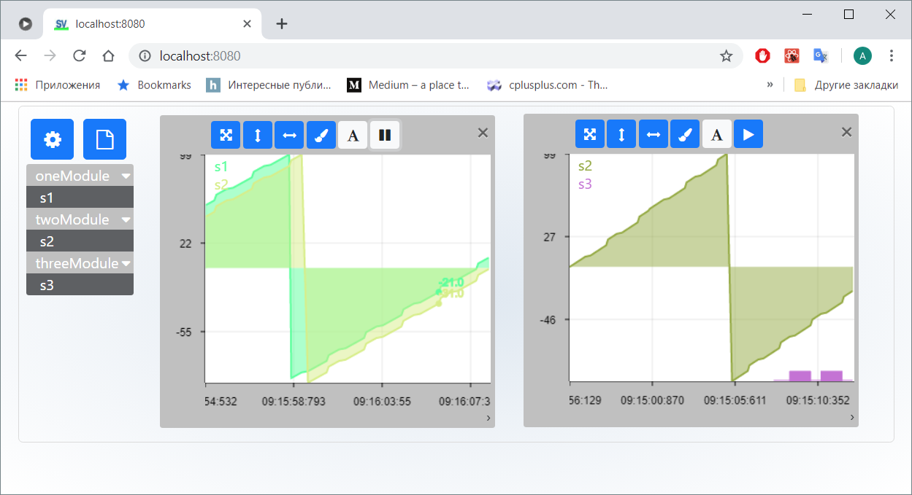
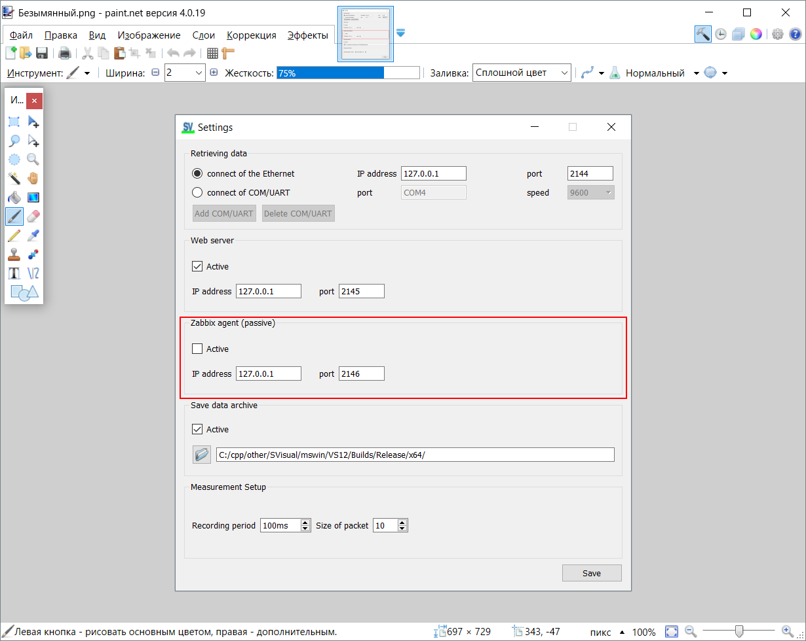
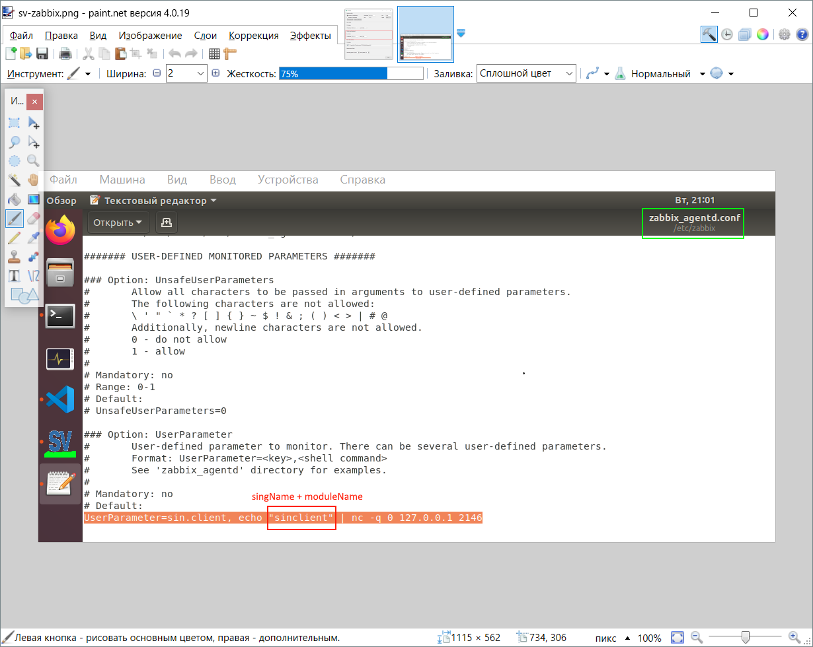

[English](../en/web-zabbix.md) | [Русский](web-zabbix.md) | [Содержание](../ru/README.md)

# Web, Zabbix, ClickHouse

Включается в **Настройках**. Это дополнительные выходы/просмотр тех же сигналов, не замена Monitor.

## Просмотр в браузере

Включите **Web-сервер**, задайте адрес и порт (по умолчанию **2145**).

## ClickHouse

Включите **сохранение в ClickHouse**. В текущем Monitor по умолчанию БД `svdb`, адрес `localhost:9000`. Нужна сборка с `USE_ClickHouseDB`.

Поставьте ClickHouse Server по официальной инструкции и укажите адрес в Monitor.

## Zabbix

Включите **пассивный агент Zabbix**. Порт по умолчанию **2146**.

В `zabbix_agentd.conf` (или в элементе данных сервера) укажите этот адрес/порт.

